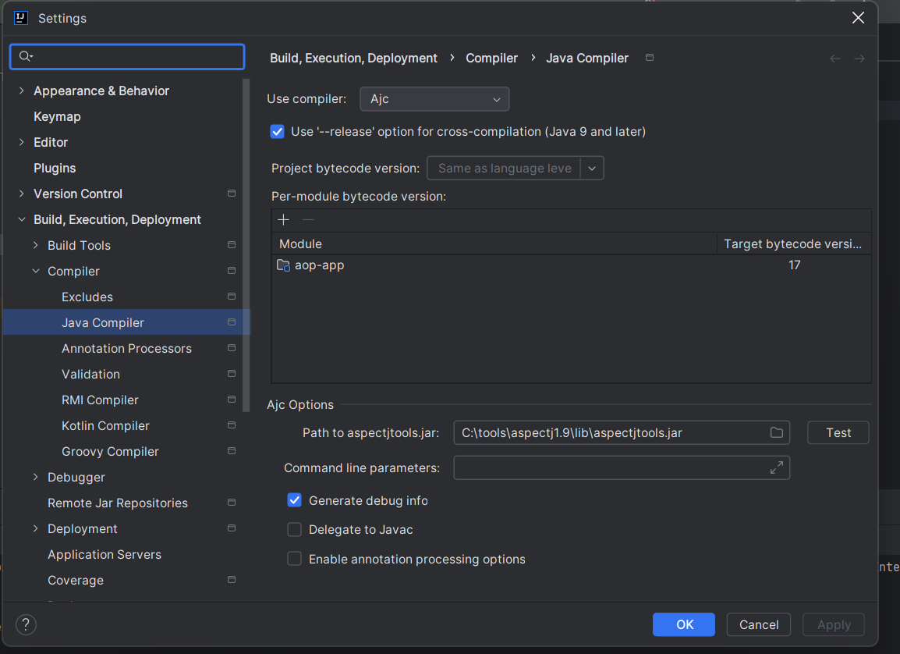

# Programmation Orientée Aspects (AOP) avec Spring et AspectJ

Ce projet est une introduction pratique à la Programmation Orientée Aspects (AOP),
en utilisant **Spring AOP** et **AspectJ**. L'objectif est de comprendre comment modulariser 
les préoccupations transversales (comme la gestion des transactions, la journalisation, ou la sécurité) 
en les séparant du code métier principal.

---

## Principales Méthodes pour Créer un Aspect

En **Spring AOP**, il existe deux principales méthodes pour créer un aspect :

### **1. Utiliser des annotations (@Aspect)**

Avec cette méthode, nous utilisons les annotations fournies par Spring pour définir un aspect. 
Voici un exemple de base :

```java
import org.aspectj.lang.annotation.Aspect;
import org.aspectj.lang.annotation.Before;

@Aspect
public class LoggingAspect {
    
    @Before("execution(* com.example.service.*.*(..))")
    public void logBeforeMethod() {
        System.out.println("Log avant l'exécution d'une méthode.");
    }
}
```

### **2. Aspect en utilisant la syntaxe AspectJ**

AspectJ permet une implémentation puissante et complète d'aspects. Voici un exemple avec un fichier `.aj` :

```java
aspect LoggingAspect {
    pointcut methodExecution(): execution(* com.example.service.*.*(..));

    before(): methodExecution() {
        System.out.println("Log avant l'exécution d'une méthode.");
    }
}
```

---

## Compilation avec AspectJ

Lorsque vous utilisez AspectJ pour définir vos aspects, la compilation standard de Java ne suffit pas.
Vous devez utiliser le compilateur **ajc** fourni avec AspectJ. Voici les étapes nécessaires :

1. **Télécharger les outils AspectJ** :  
   Assurez-vous que le fichier `aspectjtools.jar` est disponible. Vous pouvez le trouver sur [le site officiel d'AspectJ](https://github.com/eclipse-aspectj/aspectj/releases).

2. **Configurer le chemin du compilateur** :  
   Incluez `aspectjtools.jar` dans le chemin de votre projet.

3. **Exécuter la compilation** :  
   Compilez vos fichiers avec `ajc` au lieu de `javac`.




---

## Ordonnancement des Aspects

En AOP, lorsqu'il y a plusieurs aspects qui interviennent sur un même point d'exécution, l'ordre peut être crucial. Pour ordonner les aspects en AspectJ, vous pouvez utiliser l'annotation suivante :

```java
@DeclarePrecedence("ThirdAspect,SecondAspect")
public aspect PrecedenceAspect {
    // Déclare l'ordre des aspects
}
```

Dans cet exemple, `ThirdAspect` sera exécuté avant `SecondAspect`.


